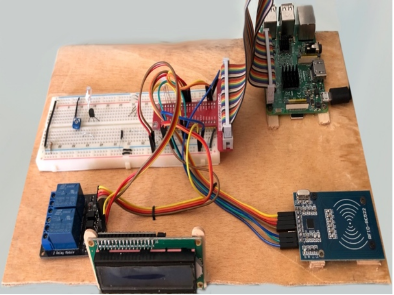
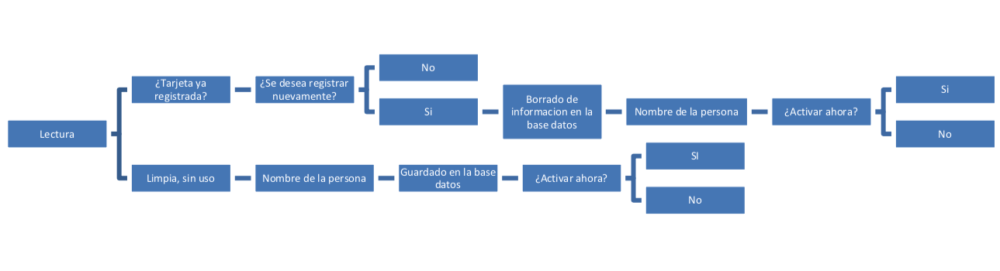

# NFCRaspi

This is a simple project of the operation of the NFC RFID RC522.

The RFID RC522 is a very low-cost RFID (Radio-frequency identification) reader and writer that is based on the MFRC522 microcontroller.

Wiring your RFID RC522 to your Raspberry Pi is fairly simple, with it requiring you to connect just 7 of the GPIO Pins directly to the RFID reader. Follow the table below, and check out our GPIO guide to see the positions of the GPIO pins that you need to connect your RC522 to.

## What do you need ?
- Raspberry Pi 1, 2, 3, 4 etc
- RFID RC522 [Buy Aliexpress](https://es.aliexpress.com/item/2026446641.html?spm=a2g0o.productlist.0.0.15d66634g7JKNW&algo_pvid=1fed02c8-02b0-4c1e-b1c2-d122f3f7f4f9&algo_exp_id=1fed02c8-02b0-4c1e-b1c2-d122f3f7f4f9-0&pdp_ext_f=%7B%22sku_id%22%3A%2265649701628%22%7D&pdp_pi=-1%3B1.34%3B-1%3B-1%40salePrice%3BEUR%3Bsearch-mainSearch)
- LCD 16x2 i2c [Buy Aliexpress](https://es.aliexpress.com/item/32988862895.html?spm=a2g0o.productlist.0.0.75d16ea4e4zpZR&algo_pvid=7e709b59-4f88-40f5-be7b-42a87a7e257f&algo_exp_id=7e709b59-4f88-40f5-be7b-42a87a7e257f-5&pdp_ext_f=%7B%22sku_id%22%3A%2212000016566792707%22%7D&pdp_pi=-1%3B3.27%3B-1%3B-1%40salePrice%3BEUR%3Bsearch-mainSearch)
- RELAY [Buy Aliexpress](https://es.aliexpress.com/item/32649659086.html?spm=a2g0o.productlist.0.0.66917deeaqFvcw&algo_pvid=1e68a544-7a94-4d2f-8a30-e65ca8462392&algo_exp_id=1e68a544-7a94-4d2f-8a30-e65ca8462392-0&pdp_ext_f=%7B%22sku_id%22%3A%2210000001526389770%22%7D&pdp_pi=-1%3B0.72%3B-1%3B-1%40salePrice%3BEUR%3Bsearch-mainSearch)
- LED RGB or LED RED, Green and Blue [Buy Aliexpress](https://es.aliexpress.com/item/4000801005379.html?spm=a2g0o.productlist.0.0.554d74103hCgA3&algo_pvid=b8adb6dc-b2f2-4d58-b1f5-abfd168bddd6&aem_p4p_detail=20220225032142193945308229200008030680&algo_exp_id=b8adb6dc-b2f2-4d58-b1f5-abfd168bddd6-34&pdp_ext_f=%7B%22sku_id%22%3A%2210000010057829641%22%7D&pdp_pi=-1%3B1.38%3B-1%3B-1%40salePrice%3BEUR%3Bsearch-mainSearch)
- Server Web and Database Server [XAMPP](https://www.apachefriends.org/es/index.html)

## Installation

If you have a recent version of Python 3, you should be able to do pip install sucks to get the most recently released version of this.

install pip spidev mfrc522 mysql.connector datetime

***MFRC522***

| DATE | GPIO pins |
| ----- | ----------------- |
| SDA | connects to Pin 24 |
| SCK | connects to Pin 23 |
| MOSI | connects to Pin 19 |
| MISO | connects to Pin 21 |
| GND | connects to Pin 6 |
| RST | connects to Pin 22 |
| 3.3v | connects to Pin 1 |

***RGB LED***

| DATE | GPIO pins |
| ----- | ----------------- |
| RED | connects to Pin 33 - GPIO 13 |
| GND | connects to Pin 6 - GPIO 6 |
| GREEN | connects to Pin 35 - GPIO 19 |
| BLUE | connects to Pin 37 - GPIO 26 |

***RELAY***
| DATE | GPIO pins |
| ----- | ----------------- |
| GND | connects to Pin 6 |
| IN1 | connects to Pin 38 – GPIO 20 |
| IN2 | connects to Pin 36 - GPIO 16 |
| VCC | connects to Pin 2 |

***LCD 16 X 2***
| DATE | GPIO pins |
| ----- | ----------------- |
| GND | connects to Pin 6 |
| VCC | connects to Pin 2 |
| SDA | connects to Pin 3 – GPIO 2 |
| SCL | connects to Pin 5 – GPIO 3 |

***FINAL INSTALLATION***

## Flow
